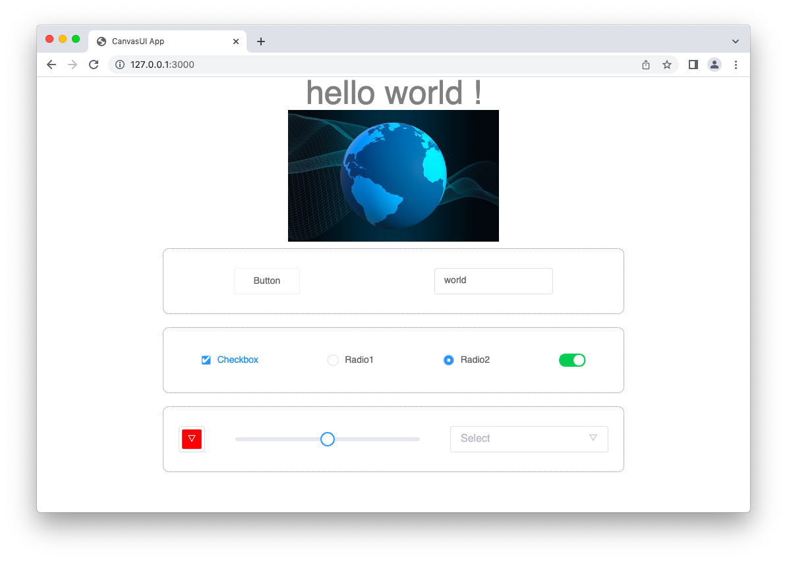

# CanvasUI
`CanvasUI` is a canvas-based UI toolkit.

[中文版](./README_CN.md)


## Introduction
`CanvasUI` re-implements the key technology of modern front-end development based on HTML &lt;canvas&gt; (without any third-party libraries), it includes:
- 10 commonly used components described in XML (e.g. &lt;button&gt;, &lt;image&gt;, and even &lt;input&gt;)
- Flex layout and commonly used CSS
- MVVM
- Scaffolding and development server out of the box (supports hot reload)
<div style="text-align: center;">
    
</div>


## Usage
1. Create a project with `npx github:canvasui/canvasui project-name`
2. Use vscode to open the project root directory to enjoy code highlighting
3. Run `npm run build` in the root directory of the project to start the development server (the code will also be packaged into the `/public` directory)
4. Use a browser to visit `http://127.0.0.1:3000/`
5. Modify `main.ui` in the `/src` directory, the browser will update and modify in real time (and package it to the `/public` directory at the same time)


## Documentation
### code structure
```html
<style>
.hello {
    font-size: 50px;
}
</style>

<template>
    <text class="hello" content="hello { name } !"></text>
</template>

<script>
return {
    data: {
        name: 'world',
    },
}
</script>
```

### built-in components
<table>
    <tr><th>component name</th><th>supported props</th><th>supported CSS</th></tr>
    <tr><td>&lt;text&gt;</td><td>content</td><td>font-size, color</td></tr>
    <tr><td>&lt;image&gt;</td><td>path</td><td>width, height</td></tr>
    <tr><td>&lt;button&gt;</td><td>label, @click</td><td></td></tr>
    <tr><td>&lt;input&gt;</td><td>value, hint</td><td>width</td></tr>
    <tr><td>&lt;checkbox&gt;</td><td>value, label</td><td></td></tr>
    <tr><td>&lt;radio&gt;</td><td>value, label, option</td><td></td></tr>
    <tr><td>&lt;switch&gt;</td><td>value</td><td></td></tr>
    <tr><td>&lt;color&gt;</td><td>value</td><td></td></tr>
    <tr><td>&lt;slider&gt;</td><td>value</td><td>width</td></tr>
    <tr><td>&lt;select&gt;</td><td>value, options</td><td></td></tr>
</table>

### Some notes
- Built-in components and container
    - The tag must have an end tag, and the prop value must be enclosed in double quotes
    - All components support id and class props, and CSS selectors can be used to add styles to them
    - &lt;input&gt; supported functions are:
        - Keyboard input characters, delete characters, move the caret left and right
        - Insert caret at mouse position
        - Mouse drag and drop to select, double click to select all
        - copy (command-c), paste (command-c), cut (command-x), select all (command-a)
    - You can use &lt;div&gt; as a container, but currently only supports single-level nesting (that is, you cannot nest another &lt;div&gt; in a &lt;div&gt;)
- CSS
    - Flex is the default and only layout method, no need to write "display: flex;"
    - The supported flex-related properties are: justify-content, align-items, flex-direction, flex-wrap, align-content, flex-flow
    - The box model can be applied to &lt;div&gt; but currently the only supported writing method is:
        - padding: length; (e.g. padding: 5px;)
        - border: border-width border-style border-color; (e.g. border: 1px solid black;)
        - margin: length; (e.g. margin: 5px;)
    - Naturally supports border-box, so width includes border and padding
    - CSS selector supports the selection of A's direct child B in the form of `A B`
- MVVM
    - The prop value can be a literal value or a variable of the form "{ xx }"
    - All input components (e.g. &lt;input&gt;, &lt;checkbox&gt;, &lt;slider&gt;) can use value="{ variable }" to achieve two-way binding


## The developer says
I am the developer of CanvasUI, I spent 13 days developing CanvasUI, the purpose is to fully understand the top-level design and underlying principles of front-end development. I am currently looking for a suitable job, if you have a suitable position (preferably working remotely), welcome to send an email to zhilin7@qq.com.
